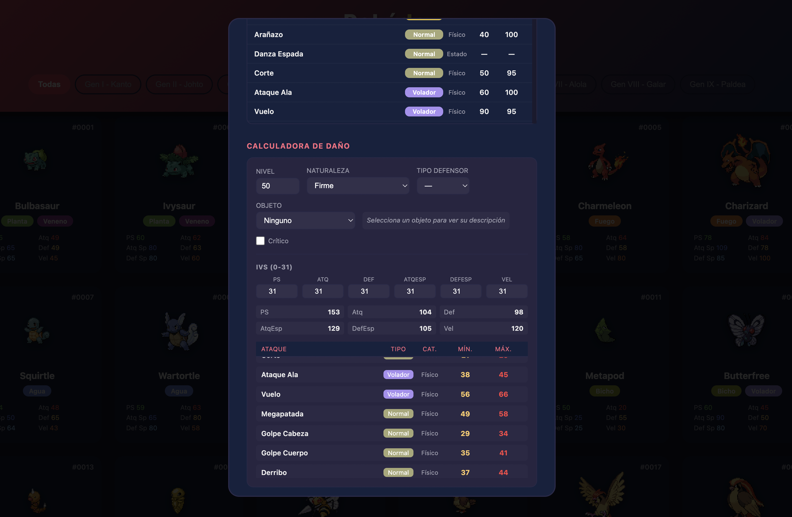

# Pokédex — Calculadora de Daño

Aplicación web para **jugadores de Pokémon competitivo**. Te permite consultar cualquier Pokémon (1025 especies), sus estadísticas, habilidades, movimientos y cadenas evolutivas, y calcular **exactamente** el daño de cada ataque en función de nivel, naturaleza, IVs, objeto, tipo defensor y crítico.

## ¿Por qué existe este proyecto?

La idea nace de la necesidad de **saber con precisión las ventajas de cada situación en un combate competitivo**. En el meta de Pokémon, ganar o perder puede depender de un puñado de puntos de daño: saber si tu ataque **debilita en 2 golpes o en 3**, si sobrevives a un ataque superefectivo, o cómo cambia el cálculo al cambiar de naturaleza u objeto, marca la diferencia.

Esta herramienta responde a preguntas concretas antes de entrar a la partida:

- ¿Cuánto daño hace mi movimiento con STAB, con objeto, contra un tipo concreto?
- ¿Qué naturaleza maximiza mi estadística clave?
- ¿El crítico me garantiza el KO?
- ¿Debo usar la banda elección o la vidasfera?

Y todo con **las fórmulas exactas del juego** (stat con naturaleza e IVs, daño con STAB / efectividad / objeto / crítico), no aproximaciones.

## Capturas

### Pokédex

Vista principal con la rejilla de Pokémon, filtro por generación y búsqueda:


### Calculadora de daño

Formulario para calcular el daño de los ataques (nivel, naturaleza, IVs, objeto, tipo defensor, crítico):



## Arquitectura

```
┌──────────────────┐    HTTP (fetch)    ┌───────────────────┐
│   Cliente React  │ ─────────────────> │   API Express     │
│   (Vite + React) │  /api/pokemon/...  │   (server/)       │
└──────────────────┘                    └────────┬──────────┘
                                                 │ carga en memoria
                                                 ▼
                                        ┌───────────────────┐
                                        │   datos/*.json    │
                                        │   (los 7 JSON)    │
                                        └───────────────────┘
```

- **`server/`** — API REST con Express. Al arrancar **carga los JSON en memoria** (como si fueran tablas de una base de datos) e indexa los registros (pokémon, movimientos, habilidades, etc.). Expone endpoints tipo base de datos que además hacen *joins* (p. ej. `/api/pokemon/:id` devuelve el Pokémon con sus movimientos y habilidades resueltos).
- **`client/`** — Frontend React (Vite). Consume la API, renderiza la rejilla de Pokémon filtrable por generación y búsqueda, la ficha completa en modal y la calculadora de daño.
- **`datos/`** — Los 7 JSON que actúan como base de datos: `pokemon.json`, `movimientos.json`, `generaciones.json`, `naturalezas.json`, `tipos.json`, `habilidades.json`, `objetos.json`.
- **`img/sprites/`** — Sprites oficiales de los 1025 Pokémon.

## Diseñado para evolucionar a una base de datos real

Los datos viven en JSON hoy, pero el proyecto está **pensado para migrar a una base de datos en producción** sin tocar el frontend:

- La capa de datos está **aislada en `server/db.js`**. Todo el acceso pasa por el mapa de rutas de `server/routes.js`, que se comunica con la "base de datos" a través de la interfaz de `db.js`.
- El frontend **nunca toca los JSON**; solo habla con la API (`GET /api/...`). Cambiar la fuente de datos no afecta al cliente.
- Para migrar basta con **reimplementar `server/db.js`** (o las funciones que consulta `routes.js`) sobre un motor real (PostgreSQL, MongoDB, SQLite...), manteniendo las mismas respuestas JSON. El resto del stack no se modifica.

Por ejemplo, hoy `db.js` hace:

```js
const db = {
  pokemon: loadJson('pokemon.json'),
  movimientos: loadJson('movimientos.json'),
  ...
};
db.pokemonMap = new Map(db.pokemon.map(p => [p.id, p]));
```

En producción, esa misma interfaz podría cargarse desde una conexión a una BD:

```js
const db = {
  pokemon: await pool.query('SELECT * FROM pokemon'),
  movimientos: await pool.query('SELECT * FROM movimientos'),
  ...
};
```

### Endpoints de la API

| Método | Ruta | Descripción |
|--------|------|-------------|
| GET | `/api/generaciones` | Lista de generaciones |
| GET | `/api/naturalezas` | Naturalezas |
| GET | `/api/tipos` | Tabla de efectividad de tipos |
| GET | `/api/habilidades` | Habilidades |
| GET | `/api/objetos` | Objetos |
| GET | `/api/movimientos` | Todos los movimientos |
| GET | `/api/pokemon` | Pokémon (filtros: `?generacion=1`, `?q=pika`) |
| GET | `/api/pokemon/:id` | Ficha completa con movimientos y habilidades resueltos |
| GET | `/api/info/generacion/:id` | Info de una generación |

## Cálculo de daño

Las funciones de cálculo están en `client/src/lib/calculadora.js` y reproducen **exactamente** las fórmulas del juego:

- **Stat con naturaleza:** `floor(((2·base + IV + EV/4)·nivel/100 + 5) · mod)` con `mod = 1.1`/`0.9` según la naturaleza.
- **PS:** `floor((2·base + IV)·nivel/100 + nivel + 10)`.
- **Daño base:** `((2·nivel/5 + 2)·potencia·atq/def)/50 + 2`.
- **Modificadores:** STAB (×1.5), efectividad de tipos (×2 / ×0.5 / ×0), objeto (vidasfera ×1.3, elección ×1.5, potenciador de tipo ×1.2) y crítico (×1.5).

## Requisitos

- Node.js 18+
- npm

## Cómo ejecutarlo

### Desarrollo (hot-reload)

```bash
npm run dev
```

- API: http://localhost:8080
- Web: http://localhost:5173

### Producción

```bash
npm run build
npm start
```

Compila el frontend y sirve la API + la web en http://localhost:8080.

## Scripts npm

| Comando | Qué hace |
|---------|----------|
| `npm run dev` | API + frontend en desarrollo |
| `npm run dev:server` | Solo la API Express |
| `npm run dev:client` | Solo el frontend Vite |
| `npm run build` | Compila el frontend |
| `npm start` | Sirve la API + frontend compilado |

## Generación de datos

Los JSON y sprites se generaron con `extraerPokemon.js` y `descargar_sprites.py` (desde la PokeAPI). Se conservan por si necesitas regenerar o actualizar los datos.